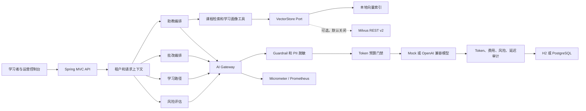

# 系统架构

## 设计目标

项目以“教育业务决策必须可解释、模型调用必须可追溯”为约束。模型负责语言理解与生成，评分、路径排序、风险分和权限边界由确定性业务逻辑控制。

## 智能助教调用链

1. `RequestContextFilter` 建立 traceId 与租户上下文。
2. `TutorService` 验证会话归属，读取最近六条消息。
3. `KnowledgeService` 生成查询向量，按 tenantId 和 courseId 检索。
4. `TutorRepository` 读取课程进度、平均掌握度和薄弱技能，作为确定性工具结果。
5. `AiGateway` 做提示词注入、学术作弊检查和 PII 脱敏。
6. `TokenBudgetService` 检查租户本月预算。
7. `AiModelClient` 调用 Mock 或真实模型。
8. `AiAuditService` 同时写调用级审计和每日 Token 聚合。
9. API 返回答案、资料引用、使用工具、Token、费用、模型与 traceId。

## 数据隔离

关键业务表均包含 `tenant_id`。Repository 查询先使用当前租户作为过滤条件，向量检索也使用 tenantId 和 courseId 过滤。

演示身份来自请求头，只模拟上游身份网关的输出。生产环境应在过滤器前增加：

- OIDC/JWT 签名与 audience 校验；
- 用户、租户和角色声明映射；
- 教师、学习者、审计员的接口级 RBAC；
- 文档和课程资源级 ABAC；
- 审计接口的字段脱敏和导出审批。

## 确定性决策与生成式能力边界

| 场景 | 确定性部分 | 模型部分 | 人工边界 |
| --- | --- | --- | --- |
| 批改 | 数值评分、置信度、复核状态 | 形成性文字反馈 | 低置信度复核 |
| 学习路径 | 掌握度排序、时间分配、检查点 | 路径原因解释 | 教师调整计划 |
| 风险预警 | 风险特征、权重、等级 | 非惩罚性干预建议 | 禁止自动退学/惩罚 |
| 助教 | 租户隔离、资料召回、引用 | 解释与追问 | 资料不足时拒答 |

## 审计数据模型

`ai_call_audit` 保存单次调用证据，`ai_token_usage_daily` 保存日聚合，`policy_violation` 保存阻断策略证据。三者可通过 traceId 和业务上下文关联。

生产化建议：

- 调用审计写入独立不可变存储；
- 对 prompt preview 设置默认关闭、审批开启；
- 模型价格按模型和时间版本化；
- 接入 OpenTelemetry Trace，将 traceId 贯穿模型代理；
- 增加响应事实性、毒性、引用一致性的离线和在线评测；
- 在异步索引链路中增加文档解析、OCR、去重、审核和重试队列。
