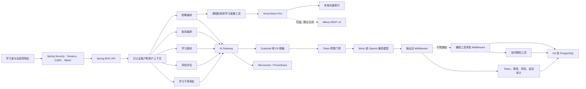

# 系统架构

## 设计目标

项目以“教育业务决策必须可解释、模型调用必须可追溯”为约束。模型负责语言理解与生成，评分、路径排序、风险分和权限边界由确定性业务逻辑控制。

## 智能助教调用链

1. `TraceIdFilter` 校验或生成 traceId，只接受长度受限的安全字符。
2. Spring Security 从 HttpOnly Session 恢复已认证用户，并按接口执行 RBAC。
3. `RequestContextFilter` 从认证主体建立 tenantId、userId 和 role 上下文；不读取客户端身份 Header。
4. `TutorService` 验证会话归属、领取数据库租约，读取历史快照与增量摘要。
5. `KnowledgeService` 生成查询向量，按 tenantId 和 courseId 检索。
6. `TutorRepository` 读取课程进度、平均掌握度和薄弱技能，作为确定性工具结果。
7. `TutorContextBuilder` 检查输入预算；必要时由 `ConversationSummaryService` 摘要较早对话，再按优先级裁剪。每次实际调用由 `AiGateway` 做提示词注入、学术作弊检查和 PII 脱敏。
8. `TokenBudgetService` 检查租户本月预算。
9. `AiModelClient` 调用 Mock 或真实模型；明确的上下文超限且尚未输出内容时，缩减上下文后最多重试一次。
10. `AiAuditService` 同时写调用级审计和每日 Token 聚合。
11. API 返回答案、资料引用、使用工具、Token、费用、模型与 traceId。

助教页面使用 `POST /api/ai/tutor/chat/stream` 获取 SSE 流。服务端依次发送
可选的 `status`、`start`、最终 `citations`、多个 `delta` 和 `done` 事件，并每秒发送 heartbeat。浏览器在
`pagehide` 时通过 `AbortController` 中止请求；服务端检测到断连或 heartbeat
写失败后，会关闭上游模型 HTTP 响应体并记录 `CANCELLED / CLIENT_DISCONNECTED`
审计。被取消的部分答案不会保存为完整助手消息。

预算配置、摘要游标、租约、恢复策略和降级边界见 [助教上下文管理](tutor-context-management.md)。

## 学习干预审批调用链

这个场景用于展示模型和敏感业务动作之间的人工边界：

1. 教师提交学习者、课程和干预目标，服务端先验证租户内的报名关系。
2. `AiGateway` 调用模型生成非惩罚性的学习支持通知。
3. 完整模型输出进入 after-model Middleware；它执行非空与长度校验、惩罚性措辞阻断、PII 脱敏，并补齐统一通知格式。
4. 编排服务把处理后的内容封装成高风险 `sendLearnerNotification` 工具调用。
5. before-tool Middleware 不执行工具，而是保存不可变参数和 `PENDING_APPROVAL` 状态并返回审批 ID。
6. 演示环境允许发起教师进行显式批准或拒绝；拒绝只改变审批状态，不产生通知。生产环境如要求四眼原则，应拆分申请人与审批人权限并禁止自批。
7. 批准时服务端锁定审批记录，在同一事务中恢复数据库通知工具、插入通知并将状态改为 `APPROVED`。通知表对 approvalId 设置唯一约束，因此重复批准不会重复写入。若替换为短信、邮件等外部副作用，必须使用 outbox 和供应商幂等键，不能依赖数据库事务提供 exactly-once。
8. 所有查询和状态迁移都带 tenantId；其他租户无法读取或决定审批。

该场景有意使用非流式模型调用，因为必须拿到完整输出并通过后置检查后，才能让内容进入审批队列。智能助教的实时流式回答保持原有链路。

## 数据隔离

关键业务表均包含 `tenant_id`。Repository 查询先使用当前租户作为过滤条件，向量检索也使用 tenantId 和 courseId 过滤。

身份和权限现在由服务端闭环验证：

- `app_user.password_hash` 保存 BCrypt 哈希，停用或未配置凭据的账号不能登录；
- 登录前必须先获取 CSRF Token，登录成功后更换 Session ID 并轮换 Token；
- Session Cookie 为 HttpOnly、SameSite=Strict，生产 HTTPS 环境通过 `SESSION_COOKIE_SECURE=true` 启用 Secure；
- `LEARNER` 只访问助教、学习路径和作业提交；
- `INSTRUCTOR` 访问运营总览、指定学习者的风险、干预审批、知识中心和提交列表；
- `AUDITOR` 访问运营总览、AI 审计和受保护的 Actuator 端点；
- 身份 Header 即使被伪造，也不会参与认证主体或租户上下文构造；
- 未登录返回 401，角色不符或 CSRF 无效返回 403。

生产环境仍应继续增加：

- 企业 OIDC/SSO、MFA 与账号生命周期管理；
- 课程、班级、文档等资源级 ABAC；
- 登录失败限流、异常登录检测与安全事件审计；
- 审计接口的字段脱敏和导出审批。

## 确定性决策与生成式能力边界

| 场景 | 确定性部分 | 模型部分 | 人工边界 |
| --- | --- | --- | --- |
| 批改 | 数值评分、置信度、复核状态 | 形成性文字反馈 | 低置信度复核 |
| 学习路径 | 掌握度排序、时间分配、检查点 | 路径原因解释 | 教师调整计划 |
| 风险预警 | 风险特征、权重、等级 | 非惩罚性干预建议 | 禁止自动退学/惩罚 |
| 干预通知 | 报名关系、输出策略、审批状态、幂等发送 | 生成友善的通知草稿 | 工具执行前必须由教师批准 |
| 助教 | 租户隔离、资料召回、引用 | 解释与追问 | 资料不足时拒答 |

## 审计数据模型

`ai_call_audit` 保存单次调用证据，`ai_token_usage_daily` 保存日聚合，`policy_violation` 保存阻断策略证据。`ai_tool_approval` 保存暂停点、工具参数与人工决策，`learner_notification` 保存批准后产生的唯一业务副作用。记录可通过 traceId、interventionId 和 approvalId 关联。

生产化建议：

- 调用审计写入独立不可变存储；
- 对 prompt preview 设置默认关闭、审批开启；
- 模型价格按模型和时间版本化；
- 接入 OpenTelemetry Trace，将 traceId 贯穿模型代理；
- 增加响应事实性、毒性、引用一致性的离线和在线评测；
- 在异步索引链路中增加文档解析、OCR、去重、审核和重试队列。
