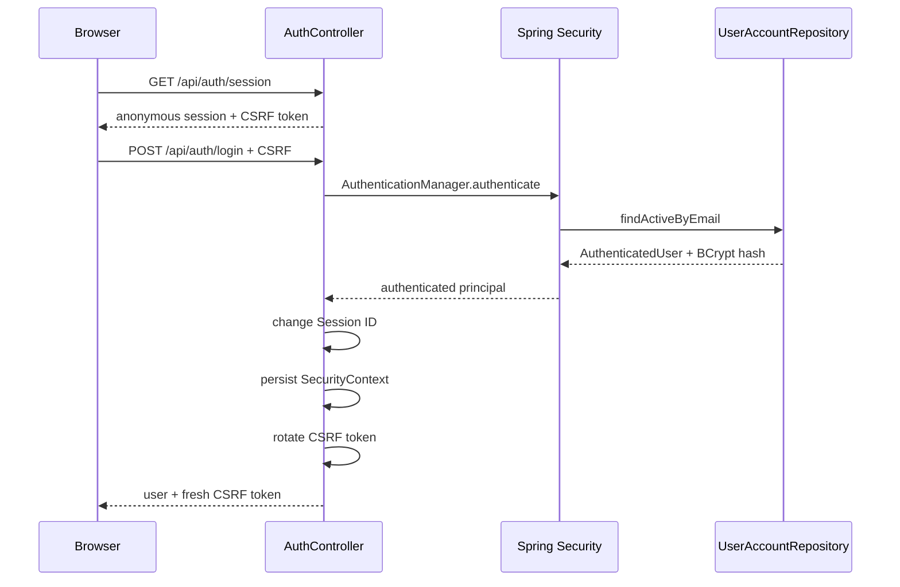
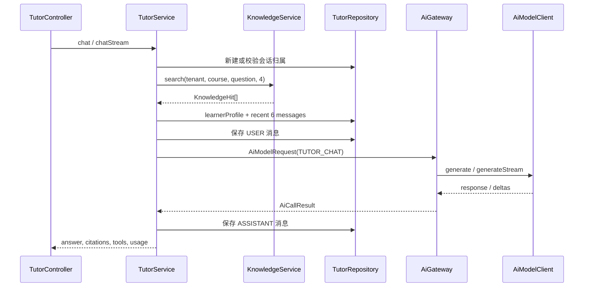
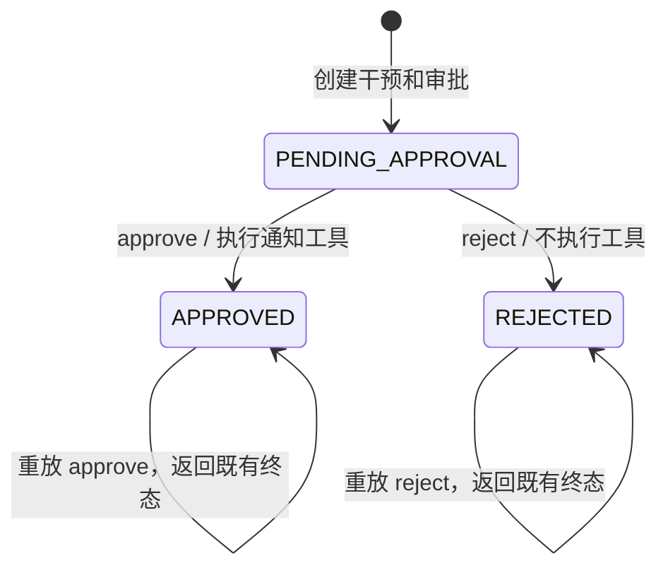

# 智培云 AI 教育培训平台研发说明

> 面向后端、前端、测试、平台与运维研发人员。本文以 `0.1.0-SNAPSHOT` 当前源码为准，整理日期为 2026-08-31。

本文不是产品宣传页，也不替代接口示例。它重点回答研发人员接手项目时最常见的几个问题：项目如何启动、请求如何穿过安全与租户边界、各业务模块怎样调用 AI、数据写到哪里、如何测试，以及哪些能力目前仍只是演示或配置模板。

配套资料：

- `README.md`：项目简介、演示入口和常用示例；
- `docs/architecture.md`：高层架构和关键业务流程；
- `docs/api-examples.md`：PowerShell 调用示例；
- `docs/milvus.md`：Milvus Collection 和接入约定；
- 本文：完整研发视角、接口矩阵、数据模型、扩展规范和已知边界。

## 1. 项目定位

这是一个面向教育培训业务的模块化单体应用。它把课程、学习者、知识库、助教、作业批改、学习路径、风险预警、人工干预和 AI 治理放在同一个多租户数据模型中。

项目遵循三条核心原则：

1. **确定性业务决策不交给模型。** 数值得分、路径顺序、风险分、权限和审批状态均由 Java/SQL 逻辑决定；模型主要负责解释和文字生成。
2. **所有模型调用都要可追踪。** 每次调用记录 traceId、场景、模型、Token、费用、延迟、风险和状态。
3. **高风险副作用必须有人类边界。** 学习干预通知先生成草稿，再经过输出后检查和工具审批；批准前不会执行通知工具。

默认模式完全离线：

- H2 文件数据库保存业务数据；
- `MockAiModelClient` 生成稳定响应；
- 本地哈希 Embedding 和内存向量库完成检索；
- 不要求 API Key，不安装或连接 Milvus。

## 2. 技术栈与构建基线

| 类别 | 当前实现 |
| --- | --- |
| 语言与编译目标 | Java 21 |
| 应用框架 | Spring Boot 4.1.0 |
| 构建工具 | Maven；项目当前没有 Maven Wrapper |
| Web | Spring WebMVC、Bean Validation、`SseEmitter` |
| 安全 | Spring Security、HttpSession、CSRF、BCrypt、RBAC |
| 数据访问 | Spring JDBC / `JdbcTemplate`；没有 JPA/Hibernate |
| 数据迁移 | Flyway V1–V6 |
| 默认数据库 | H2 文件数据库 |
| 可选数据库 | PostgreSQL Profile，目前仍是待补齐模板，见第 17 节 |
| AI 模型 | Mock 或 OpenAI-compatible Chat Completions |
| 流式调用 | JDK `HttpClient`、虚拟线程、SSE |
| Embedding | 本地哈希或 OpenAI-compatible Embeddings |
| 向量存储 | 进程内余弦检索或 Milvus REST v2 |
| 可观测性 | Actuator、Micrometer、Prometheus、数据库 AI 审计 |
| 前端 | 原生 HTML/CSS/JavaScript，无 Node/npm 构建链 |
| 测试 | JUnit 5、Spring Boot Test、MockMvc、Spring Security Test、H2 |

Maven 坐标：

```text
com.xiaomi.education:ai-education-platform:0.1.0-SNAPSHOT
```

应用入口是 `src/main/java/com/xiaomi/education/EducationAiApplication.java`。`@ConfigurationPropertiesScan` 会加载 `AiProperties` 和 `VectorProperties`，默认监听 `8080` 端口。

## 3. 仓库结构

```text
ai-education-platform/
├── pom.xml
├── README.md
├── .env.example
├── scripts/
│   ├── run-local.ps1
│   └── test.ps1
├── docs/
│   ├── architecture.md
│   ├── api-examples.md
│   ├── milvus.md
│   └── developer-guide.md
└── src/
    ├── main/
    │   ├── java/com/xiaomi/education/
    │   └── resources/
    │       ├── application.yml
    │       ├── application-postgres.yml
    │       ├── application-milvus.yml
    │       ├── db/migration/
    │       └── static/
    └── test/
        ├── java/com/xiaomi/education/
        └── resources/application.yml
```

后端包职责：

| 包 | 职责 | 主要入口 |
| --- | --- | --- |
| `ai` | AI 统一网关、流式调用抽象 | `AiGateway`、`AiStreamingCall` |
| `ai.model` | 模型 Port、Mock/OpenAI 实现、场景、Token 估算 | `AiModelClient`、`OpenAiCompatibleModelClient` |
| `ai.guardrail` | 输入注入/作弊阻断和 PII 脱敏 | `GuardrailService` |
| `ai.middleware` | 输出后检查、敏感工具审批、工具恢复执行 | `PostModelMiddleware`、`ToolExecutionMiddleware` |
| `ai.audit` | 单次审计、日聚合、Token 预算和审计 API | `AiAuditService`、`TokenBudgetService` |
| `security` | 数据库账号、Session 登录、CSRF、RBAC | `SecurityConfig`、`AuthController` |
| `tenant` | traceId 和已认证租户上下文 | `TraceIdFilter`、`RequestContextFilter` |
| `knowledge` | 文档切分、Embedding、向量检索 | `KnowledgeService`、`VectorStore` |
| `tutor` | RAG、多轮会话、学习画像、同步/SSE 助教 | `TutorService` |
| `grading` | 确定性评分、AI 反馈、提交记录 | `GradingService` |
| `learning` | 掌握度驱动的学习路径 | `LearningPathService` |
| `risk` | 可解释风险分和可选 AI 解释 | `LearnerRiskService` |
| `intervention` | 干预草稿、审批和通知副作用 | `InterventionService` |
| `dashboard` | 租户业务与 AI 运营汇总 | `DashboardService` |
| `common` | 统一异常、错误体、哈希工具 | `ApiErrorHandler`、`ApiException` |
| `config` | 类型化配置 | `AiProperties`、`VectorProperties` |

## 4. 总体运行架构

```mermaid
flowchart LR
    Browser["原生 Web 控制台"] --> Trace["TraceIdFilter"]
    Trace --> Security["Spring Security<br/>Session + CSRF + RBAC"]
    Security --> Context["RequestContextFilter<br/>TenantContext"]
    Context --> Controller["Spring MVC Controller"]

    Controller --> Business["业务 Service<br/>确定性规则"]
    Business --> Repo["JdbcTemplate Repository"]
    Repo --> DB["H2 / PostgreSQL 模板"]

    Business --> Gateway["AiGateway"]
    Gateway --> InputGuard["输入 Guardrail"]
    InputGuard --> Budget["Token 预算"]
    Budget --> Model["Mock / OpenAI-compatible"]
    Model --> OutputGuard["输出后 Middleware"]
    OutputGuard --> Audit["审计 + Token 聚合 + 指标"]
    Audit --> DB

    Business --> Knowledge["KnowledgeService"]
    Knowledge --> Embedding["Hash / OpenAI Embedding"]
    Embedding --> Vector["内存向量 / Milvus"]

    OutputGuard --> Approval["敏感工具审批"]
    Approval --> Notification["站内通知工具"]
    Notification --> DB
```



一次已登录业务请求的通用生命周期如下：

1. `TraceIdFilter` 接受合法 `X-Trace-Id`，否则生成 UUID，并把 traceId 放入 MDC 和响应头。
2. Spring Security 从 HttpSession 恢复 `AuthenticatedUser`。
3. 授权规则按 HTTP 方法、路径和角色判断是否放行。
4. `RequestContextFilter` 从认证主体建立 `TenantContext(tenantId, userId, role)`。
5. Controller 做参数绑定和 Bean Validation。
6. Service 编排确定性业务逻辑、Repository、知识检索和 AI 调用。
7. Repository 查询必须显式带 `tenantId`；当前项目没有 ORM 自动租户过滤器。
8. 成功结果序列化为 JSON；异常由统一错误处理器转换。
9. 请求结束后清理 `TenantContext` 和 MDC。

`TenantContext` 使用 `ThreadLocal`，不能把“稍后执行且仍调用 `TenantContext.current()` 的任务”直接扔到任意线程池。当前流式链路在启动阶段捕获 tenant/trace 信息，异步回调不再依赖请求线程中的上下文；新增异步任务时也要遵循这一点。

## 5. 本地启动

### 5.1 环境要求

- Java 21 或更高版本；
- Maven。README 声明 `3.6.3+`，POM 本身未通过 Enforcer 固定 Maven 版本；
- 默认模式不需要 PostgreSQL、Milvus、Node.js 或外部模型服务。

最低编译目标是 Java 21。当前最近一次完整测试实际运行在 WSL2 / OpenJDK 25.0.4。

### 5.2 推荐的通用 Maven 命令

```powershell
mvn spring-boot:run
```

打开：

```text
http://localhost:8080
```

构建与运行 Jar：

```powershell
mvn clean package
java -jar .\target\ai-education-platform-0.1.0-SNAPSHOT.jar
```

运行测试：

```powershell
mvn test
```

### 5.3 现有 PowerShell 脚本

```powershell
powershell -ExecutionPolicy Bypass -File .\scripts\run-local.ps1
powershell -ExecutionPolicy Bypass -File .\scripts\test.ps1
```

这两个脚本目前带有本机路径假设：

- 固定尝试 `D:\soft\jdk25-2`；
- 固定尝试 `D:\soft\maven\apache-maven-3.8.1\bin\mvn.cmd`；
- `run-local.ps1` 在固定 Maven 不存在时会回退到 PATH 中的 `mvn`；
- `test.ps1` 没有对应回退逻辑；
- README 中的固定项目目录也不是通用路径。

新开发环境优先直接使用 PATH 中的 Maven。后续建议补充 Maven Wrapper，并让两个脚本共享同一套 Java/Maven 探测逻辑。

### 5.4 默认数据与演示账号

Flyway 首次启动会创建演示租户、课程、知识片段、作业、学习记录和三个账号：

| 角色 | 邮箱 | 本地演示密码 | 主要能力 |
| --- | --- | --- | --- |
| `LEARNER` | `linxiao@example.com` | `Demo123!` | 助教、学习路径、作业提交 |
| `INSTRUCTOR` | `wang@example.com` | `Demo123!` | 总览、风险、干预、知识 API |
| `AUDITOR` | `audit@example.com` | `Demo123!` | 总览、AI 审计、受保护 Actuator |

密码以 BCrypt（strength 12）哈希保存。预填密码和演示账号只用于本地环境。

## 6. 配置与 Profile

### 6.1 默认 Profile

`src/main/resources/application.yml` 的关键默认值：

| 配置 | 默认值 | 说明 |
| --- | --- | --- |
| `server.port` | `8080` | HTTP 端口 |
| `server.shutdown` | `graceful` | 优雅停机 |
| Session timeout | `30m` | HttpSession 过期时间 |
| Cookie | HttpOnly、SameSite=Strict | `Secure` 由环境变量控制 |
| Datasource | `jdbc:h2:file:./data/edu-ai...` | 相对启动工作目录 |
| `edu.ai.provider` | `mock` | 默认不访问外部服务 |
| `edu.ai.temperature` | `0.2` | 真实 Chat 请求温度 |
| `edu.ai.timeout-seconds` | `45` | 模型连接/请求超时基线 |
| `edu.ai.monthly-token-budget` | `1000000` | 找不到租户配置时的回退预算 |
| `edu.ai.store-prompt-preview` | `true` | 生产环境建议关闭 |
| `edu.vector.provider` | `in-memory` | 内存向量库 |
| `edu.vector.dimensions` | `128` | 本地哈希向量维度，最低强制 32 |
| `edu.vector.embedding-provider` | `local-hash` | 本地 Embedding |

H2 文件写入 `./data/`，该目录已被 Git 忽略。项目没有启用 H2 Console。

### 6.2 环境变量

| 环境变量 | 默认值 | 用途 |
| --- | --- | --- |
| `SESSION_COOKIE_SECURE` | `false` | HTTPS 生产环境应设为 `true` |
| `EDU_AI_PROVIDER` | `mock` | `mock` 或 `openai-compatible` |
| `AI_BASE_URL` | `https://api.openai.com` | Chat 与 Embedding 共用 Base URL |
| `AI_API_KEY` | 空 | 真实 Chat 或 Embedding 必填 |
| `AI_CHAT_MODEL` | `gpt-4.1-mini` | Chat Completions 模型 |
| `VECTOR_STORE` | `in-memory` | `in-memory` 或 `milvus` |
| `EMBEDDING_PROVIDER` | `local-hash` | `local-hash` 或 `openai-compatible` |
| `EMBEDDING_MODEL` | `text-embedding-3-small` | Embedding 模型 |
| `MILVUS_BASE_URL` | `http://localhost:19530` | Milvus REST 地址 |
| `MILVUS_TOKEN` | `root:Milvus` | 演示默认值，生产必须替换 |
| `MILVUS_DATABASE` | `default` | Milvus Profile 可覆盖 |
| `MILVUS_COLLECTION` | `education_knowledge_chunks` | Milvus Collection |
| `DB_URL` | `jdbc:postgresql://localhost:5432/edu_ai` | PostgreSQL Profile |
| `DB_USERNAME` | `edu_ai` | PostgreSQL 用户 |
| `DB_PASSWORD` | `edu_ai` | PostgreSQL 密码，生产必须替换 |
| `SPRING_PROFILES_ACTIVE` | 空 | `postgres`、`milvus` 或组合 |

`.env.example` 只是变量示例。项目没有 dotenv 加载器，因此复制为 `.env` 不会自动生效；必须由 Shell、IDE、容器或进程管理器注入。

### 6.3 真实模型

```powershell
$env:EDU_AI_PROVIDER = 'openai-compatible'
$env:AI_BASE_URL = 'https://your-provider.example.com'
$env:AI_API_KEY = 'replace-me'
$env:AI_CHAT_MODEL = 'replace-with-model'
mvn spring-boot:run
```

`OpenAiCompatibleModelClient` 调用：

```text
POST {AI_BASE_URL}/v1/chat/completions
Authorization: Bearer {AI_API_KEY}
```

流式请求会发送 `stream=true` 和 `stream_options.include_usage=true`。提供方如果不返回 Token Usage，流式客户端使用本地 `TokenEstimator` 回退估算。

启用真实 Embedding：

```powershell
$env:EMBEDDING_PROVIDER = 'openai-compatible'
$env:EMBEDDING_MODEL = 'replace-with-embedding-model'
```

Embedding 调用 `POST /v1/embeddings`，与 Chat 共用 `AI_BASE_URL` 和 `AI_API_KEY`。

### 6.4 Milvus

```powershell
$env:SPRING_PROFILES_ACTIVE = 'milvus'
$env:VECTOR_STORE = 'milvus'
$env:MILVUS_BASE_URL = 'http://your-milvus:19530'
$env:MILVUS_TOKEN = 'user:password'
$env:MILVUS_DATABASE = 'default'
$env:MILVUS_COLLECTION = 'education_knowledge_chunks'
mvn spring-boot:run
```

Milvus Profile 只切换适配器，不会安装 Milvus、创建 Collection 或索引。字段约定见 `docs/milvus.md`，向量维度必须与 Embedding 输出一致。

### 6.5 PostgreSQL

配置模板：

```powershell
$env:SPRING_PROFILES_ACTIVE = 'postgres'
$env:DB_URL = 'jdbc:postgresql://localhost:5432/edu_ai'
$env:DB_USERNAME = 'edu_ai'
$env:DB_PASSWORD = 'replace-me'
mvn spring-boot:run
```

当前 PostgreSQL Profile **尚未达到开箱即用和已验证状态**，不能仅切 Profile 后直接承诺可运行。确定阻塞项见第 17 节。

## 7. 认证、Session、CSRF 与租户边界

### 7.1 登录流程



账号查找会：

- `trim()` 并小写化邮箱；
- 要求用户状态为 `ACTIVE`；
- 要求 `password_hash` 非空；
- 要求所属租户状态为 `ACTIVE`；
- 对外统一返回“邮箱或密码错误”，不泄露账号是否存在或停用。

### 7.2 Cookie 与 CSRF

- Session Cookie 为 HttpOnly、SameSite=Strict；
- 生产 HTTPS 环境必须设置 `SESSION_COOKIE_SECURE=true`；
- 登录成功后更换 Session ID，降低 Session Fixation 风险；
- 登录成功后轮换 CSRF Token；
- 所有非 GET/HEAD/OPTIONS 请求都要携带当前 CSRF Header；
- 登录接口虽然允许匿名访问，但仍受 CSRF 保护；
- 注销接口成功返回 204，并使 Session 失效、清除认证和 `JSESSIONID`。

### 7.3 traceId

客户端可传：

```text
X-Trace-Id: client-generated-id
```

只接受正则 `[A-Za-z0-9._-]{1,64}`。缺失或非法时生成 UUID。服务端将最终值写入：

- 响应头 `X-Trace-Id`；
- SLF4J MDC；
- API 错误体；
- AI 调用审计；
- 干预记录。

`X-Tenant-Id`、`X-User-Id` 和 `X-User-Role` 不参与身份构造，即使伪造也不会改变服务端认证主体。

### 7.4 RBAC

| 能力 | LEARNER | INSTRUCTOR | AUDITOR |
| --- | :---: | :---: | :---: |
| 助教和会话 | ✓ |  |  |
| 学习路径 | ✓ |  |  |
| 提交作业批改 | ✓ |  |  |
| Dashboard |  | ✓ | ✓ |
| 风险评估与解释 |  | ✓ |  |
| 干预审批 |  | ✓ |  |
| 知识 API |  | ✓ |  |
| 提交列表 API |  | ✓ |  |
| AI 审计 |  |  | ✓ |
| 受保护 Actuator |  |  | ✓ |

前端按角色隐藏菜单只是交互优化。权限边界以 `SecurityConfig` 为准。

## 8. HTTP API 总览

通用约定：

- Content-Type：普通业务写请求使用 `application/json`；流式助教返回 `text/event-stream`；
- JSON Record 响应通常为 camelCase；`JdbcTemplate.queryForMap/queryForList` 返回的 SQL 别名通常为 snake_case；
- `spring.jackson.default-property-inclusion=non_null`，null 字段通常不输出；
- 成功创建接口当前仍返回 200，没有使用 201；
- 除公开端点外都需要认证；所有 POST 都需要 CSRF。

### 8.1 端点矩阵

| 方法与路径 | 角色 | 请求 | 响应摘要 |
| --- | --- | --- | --- |
| GET `/api/auth/session` | 公开 | 无 | `AuthSession`、CSRF |
| POST `/api/auth/login` | 公开 + CSRF | `email`, `password` | 已认证 `AuthSession` |
| POST `/api/auth/logout` | 任意已登录 + CSRF | 无 | 204 |
| GET `/api/dashboard/overview` | INSTRUCTOR/AUDITOR | 无 | tenant/business/ai 汇总 |
| GET `/api/dashboard/courses` | INSTRUCTOR/AUDITOR | 无 | 课程与平均进度 |
| GET `/api/dashboard/assignments` | INSTRUCTOR/AUDITOR | 无 | 作业列表 |
| POST `/api/knowledge/documents` | INSTRUCTOR | `IngestRequest` | 文档和 Chunk 数 |
| GET `/api/knowledge/documents` | INSTRUCTOR | 无 | 文档列表 |
| GET `/api/knowledge/search` | INSTRUCTOR | `courseId?`, `query`, `limit=5` | `KnowledgeHit[]` |
| POST `/api/ai/tutor/chat` | LEARNER | `TutorChatRequest` | 完整 `TutorResponse` |
| POST `/api/ai/tutor/chat/stream` | LEARNER | 同上 | SSE 事件流 |
| GET `/api/ai/tutor/conversations` | LEARNER | 无 | 当前学习者会话 |
| POST `/api/ai/learning-paths` | LEARNER | `LearningPathRequest` | 新学习计划 |
| GET `/api/ai/learning-paths` | LEARNER | 无 | 当前学习者计划摘要 |
| POST `/api/ai/grading` | LEARNER | `GradeRequest` | 评分、反馈和用量 |
| GET `/api/ai/grading/submissions` | INSTRUCTOR | 无 | 提交摘要；当前语义缺口见第 17 节 |
| GET `/api/ai/risk/assessment` | INSTRUCTOR | `learnerId`, `courseId` | 确定性风险结果 |
| POST `/api/ai/risk/explain` | INSTRUCTOR | 同上 | 含 AI 解释的风险结果 |
| POST `/api/ai/interventions` | INSTRUCTOR | `InterventionRequest` | 草稿和待审批记录 |
| GET `/api/ai/interventions/approvals` | INSTRUCTOR | 无 | 审批队列 |
| POST `/api/ai/interventions/approvals/{id}/approve` | INSTRUCTOR | `comment?` | 批准终态 |
| POST `/api/ai/interventions/approvals/{id}/reject` | INSTRUCTOR | `comment?` | 拒绝终态 |
| GET `/api/ai/interventions/notifications` | INSTRUCTOR | 无 | 已发送站内通知 |
| GET `/api/ai-audit/events` | AUDITOR | `limit=50` | 最近调用事件 |
| GET `/api/ai-audit/token-usage` | AUDITOR | `days=30` | 日/场景/模型聚合 |
| GET `/api/ai-audit/overview` | AUDITOR | `days=30` | 调用、Token、费用、延迟汇总 |

Actuator：

- `/actuator/health`、`/actuator/info` 公开；
- 其余 `/actuator/**` 仅 `AUDITOR`；
- 当前暴露 `health`、`info`、`metrics`、`prometheus`。

### 8.2 请求校验

| 请求 | 主要约束 |
| --- | --- |
| `LoginRequest` | email 必填、合法、最长 256；密码 8–128 |
| `IngestRequest` | title 最长 256；sourceType 必填；content 最长 100000 |
| `TutorChatRequest` | courseId 必填；question 必填且最长 4000 |
| `LearningPathRequest` | goal 最长 500；weeklyMinutes 60–1200 |
| `GradeRequest` | assignmentId 必填；answer 20–20000 |
| `InterventionRequest` | learnerId/courseId 最长 64；objective 最长 1000 |
| `ApprovalDecisionRequest` | comment 可空，最长 1000 |

知识检索 `limit`、审计 `limit` 和 `days` 没有全部在 Controller 层声明 Bean Validation，但 Service/Store 会做边界收敛：知识检索 1–20、审计事件 1–200、审计天数 1–365。

### 8.3 统一错误体

```json
{
  "code": "ERROR_CODE",
  "message": "中文错误说明",
  "details": [],
  "traceId": "4a47...",
  "timestamp": "2026-08-31T01:23:45Z"
}
```

主要映射：

| 场景 | HTTP | code |
| --- | ---: | --- |
| 请求体或参数校验失败 | 400 | `VALIDATION_ERROR` |
| 未登录 | 401 | `AUTHENTICATION_REQUIRED` |
| 凭据错误 | 401 | `INVALID_CREDENTIALS` |
| 角色不符或 CSRF 无效 | 403 | `ACCESS_DENIED` |
| 资源不属于当前租户/用户 | 404 | 对应业务 `*_NOT_FOUND` |
| 审批相反决策或状态冲突 | 409 | `APPROVAL_ALREADY_DECIDED` 等 |
| 输入或输出策略阻断 | 422 | `AI_POLICY_BLOCKED` / `MODEL_OUTPUT_POLICY_BLOCKED` |
| Token 预算耗尽 | 429 | `TOKEN_BUDGET_EXCEEDED` |
| 模型、Embedding、Milvus 上游错误 | 502 | 对应 provider error |
| 未预期异常 | 500 | `INTERNAL_ERROR` |

SSE 已建立后的异常不能再返回普通 JSON，而是发送 `error` 事件。客户端断开引起的 `AsyncRequestNotUsableException` 只记 debug，不转换为 500。

## 9. AI 网关、模型与治理

### 9.1 AI 场景

`AiScenario` 是审计、提示词模板版本和模型请求元数据的统一场景枚举：

| 场景 | promptTemplate | 当前调用方 |
| --- | --- | --- |
| `TUTOR_CHAT` | `tutor-rag` | `TutorService` |
| `ASSIGNMENT_GRADING` | `rubric-grading` | `GradingService` |
| `LEARNING_PATH` | `adaptive-path` | `LearningPathService` |
| `RISK_EXPLANATION` | `dropout-risk` | `LearnerRiskService` |
| `LEARNER_INTERVENTION` | `learner-intervention` | `InterventionService` |
| `CONTENT_SUMMARY` | `content-summary` | 预留，当前没有业务入口 |

所有场景当前的 prompt 版本均为 `1.0.0`。项目没有按场景动态选择不同模型；同一个运行实例只注入一个 `AiModelClient`。

### 9.2 非流式调用链

`AiGateway.execute()` 的处理顺序：

1. 读取 `TenantContext` 和 traceId。
2. 对原始 `systemPrompt + userPrompt` 计算 SHA-256。
3. `GuardrailService.inspect(userPrompt)` 做输入检查。
4. 输入策略命中时写 `BLOCKED` 审计和 `policy_violation`，不调用模型。
5. PII 命中时把 userPrompt 中的敏感值替换为占位符后继续。
6. `TokenBudgetService.assertAvailable()` 检查租户本月预算。
7. `AiModelClient.generate()` 调 Mock 或真实模型。
8. `PostModelMiddleware.process()` 做输出后处理。
9. 写单次审计、每日 Token 聚合和 Micrometer 指标。
10. 返回 `AiCallResult`。

`AiCallResult` 包含：

```text
content, traceId, provider, model,
inputTokens, outputTokens, cachedTokens,
estimatedCost, latencyMs, riskCodes, middlewareChecks
```

### 9.3 输入 Guardrail

`GuardrailService` 当前是正则规则，不是独立模型：

| 类型 | 处理 |
| --- | --- |
| Prompt Injection / system prompt 探测 / jailbreak | 阻断，HIGH |
| 替考、代写、绕过监考 | 阻断，HIGH |
| 手机号 | 替换为 `[PHONE_REDACTED]` |
| 邮箱 | 替换为 `[EMAIL_REDACTED]` |
| 身份证号 | 替换为 `[ID_REDACTED]` |

PII 脱敏后请求仍允许调用模型，风险级别为 MEDIUM。正则只能覆盖已定义格式，不等同于完整 DLP；生产环境需要更完整的分类、误报/漏报评估和策略版本管理。

### 9.4 输出后 Middleware

当前只有 `LEARNER_INTERVENTION` 有实质性输出策略：

- 内容不得为空；
- 原始模型正文最多 800 个 Unicode code point；
- 阻断扣分、处分、退学、取消资格等惩罚性措辞；
- 再次运行 Guardrail 并脱敏 PII；
- 增加固定“学习支持提醒”前缀和 AI 辅助说明后缀；
- 返回 `postModelChecks` 清单。

因为必须拿到完整输出后才能检查，`AiGateway.executeStream()` 会拒绝干预场景，并返回 `STREAMING_NOT_SUPPORTED_FOR_SCENARIO`。

其他场景目前输出透传。特别是 Tutor 的流式 token 会立即发送到浏览器，事后无法撤回；这是生产化前需要单独设计的安全边界。

### 9.5 模型实现

`MockAiModelClient`：

- 默认启用；
- 按场景返回确定性文本；
- Token 使用本地估算；
- 流式响应通过虚拟线程分块发出，便于离线测试。

`OpenAiCompatibleModelClient`：

- `EDU_AI_PROVIDER=openai-compatible` 时启用；
- 缺少 `AI_API_KEY` 会在启动阶段失败；
- 同步使用 Spring `RestClient`；
- 流式使用 JDK `HttpClient` 和虚拟线程；
- 解析 `data:` SSE 事件、Usage 和 `[DONE]`；
- 供应商未返回 Usage 时回退到 `TokenEstimator`；
- `cancel()` 会取消 Future、关闭上游响应 Body Stream。

当前没有自动重试、熔断、bulkhead、限并发、备用模型、模型灰度、模型路由或 agent loop。Tutor 中展示的 `knowledgeSearch`、`learnerProfile` 是应用直接调用的工具元数据，不是模型 function calling。

### 9.6 Token 预算、费用和指标

预算检查按租户查询：

```text
本月已用量 = SUM(input_tokens + output_tokens)
```

优先使用 `tenant.token_budget`；找不到租户时才回退到 `edu.ai.monthly-token-budget`。当已用量大于等于预算时返回 429。检查发生在调用前，但没有为“本次调用”预留额度，并发请求可能短暂超预算。

演示费用单价硬编码在 `AiGateway`：

```text
输入：0.80 / 1,000,000 Token
输出：3.20 / 1,000,000 Token
```

这只是演示估算，不应作为供应商结算依据。需要按 provider/model/生效时间维护版本化价格表。

Micrometer 指标：

```text
edu.ai.requests{scenario,status}
edu.ai.tokens{type,model}
```

### 9.7 AI 审计

调用状态实际包括：

- `SUCCESS`
- `BLOCKED`
- `FAILED`
- `CANCELLED`

审计原则：

- 原始完整系统提示词和完整响应不写入 AI 审计表；
- 保存原始 system+user prompt 的 SHA-256；
- `prompt_preview` 是脱敏后的用户提示前 N 字，默认 240；
- 成功保存处理后响应的哈希；
- 输出策略阻断保存模型原始响应哈希，并用它作为违规证据；
- 输入策略阻断使用 prompt hash 作为违规证据；
- 输出阻断和取消只要已有 Token，也会计入日聚合。

生产环境建议将 `edu.ai.store-prompt-preview` 设为 `false`，并对审计数据实施加密、保留周期、删除和导出审批。

## 10. 核心业务流程

### 10.1 RAG 智能助教



关键行为：

- 不传 `conversationId` 时创建新会话；
- 继续会话时必须同时匹配 conversationId、tenantId 和当前 learnerId；
- 检索固定取 4 个结果；
- Prompt 包含课程资料、学习画像、历史摘要和预算内的近期对话；超预算时增量摘要、裁剪，供应商超限时最多缩减重试一次，详见 [上下文管理](tutor-context-management.md)；
- 引用返回 documentId、chunkId、相似度和最多 160 字摘要；
- `usedTools` 固定记录 `knowledgeSearch` 和 `learnerProfile`；
- 用户消息在模型调用前保存；模型失败、策略阻断或流取消时可能只留下 USER 消息；
- 只有完整成功的回答才保存为 ASSISTANT 消息。

### 10.2 Tutor SSE

`POST /api/ai/tutor/chat/stream` 使用 POST、JSON Body、Session 和 CSRF，因此浏览器不能直接用原生 `EventSource`，前端通过 `fetch()` 读取 `ReadableStream`。

事件契约：

| 事件 | 数据 |
| --- | --- |
| `status` | 上下文整理或重试状态 message |
| `start` | conversationId、空 citations、usedTools |
| `citations` | 最终尝试的 citations，在首个 delta 前发送 |
| `delta` | `{ "text": "本次增量" }` |
| `done` | conversationId、citations、usedTools、usage |
| `error` | code、message |
| heartbeat comment | `keepalive`，每秒一次 |

默认上下文请求总时限为 60 秒，包含摘要和重试，`SseEmitter` timeout 为 62 秒。响应设置：

```text
Cache-Control: no-cache, no-transform
X-Accel-Buffering: no
```

取消链：

```text
浏览器 Abort / heartbeat 写失败
  -> TutorStream.cancel
  -> AiStreamingCall.cancel
  -> AiModelStream.cancel
  -> 关闭上游 HTTP Body/连接
```

客户端断开审计为 `CANCELLED / CLIENT_DISCONNECTED`，并对已产生的部分内容做本地 Token 与费用估算。

### 10.3 知识入库与检索

入库顺序：

1. 清理换行；
2. 以约 600 字符切分，重叠 80 字符；
3. 为每个 Chunk 估算 Token 并计算 Embedding；
4. 事务写入 `knowledge_document` 和 `knowledge_chunk`；
5. 调用 `VectorStore.upsert()`；
6. 返回 `INDEXED`。

应用收到 `ApplicationReadyEvent` 后，会读取关系库中的全部 Chunk、重新计算 Embedding 并重建运行时索引。默认内存实现把 Chunk 放入 `ConcurrentHashMap`；搜索时显式按 tenantId 和可选 courseId 过滤，做余弦排序，最低分 0.05，limit 收敛到 1–20。

关系库事务和 Milvus Upsert 不是同一个事务边界。外部向量写入失败时，关系库可能已经保存状态为 `INDEXED`，需要后续用 outbox/索引任务状态机解决一致性问题。

### 10.4 作业批改

数值得分由本地启发式规则产生：

| 维度 | 权重 | 当前计算 |
| --- | ---: | --- |
| completeness | 20% | 答案长度 / 600，最多 1 |
| architecture | 40% | “切分、向量、检索、提示词、引用”覆盖率 |
| governance | 25% | “审计、token、脱敏、注入、复核、降级”覆盖率 |
| clarity | 15% | `0.45 + 非空段落数 × 0.1`，最多 1 |

最终分数为 `maxScore × scoreRatio`。置信度综合答案长度和关键词覆盖，低于 `0.72` 时进入 `HUMAN_REVIEW`，否则为 `AI_GRADED`。

模型只生成形成性反馈，不决定分数。模型成功后才保存 submission；模型失败时规则分数不会单独落库。

### 10.5 学习路径

Repository 先按 `mastery ASC, evidence_count ASC` 排序。Service 最多选择 4 个技能：

| 当前掌握度 | 活动 |
| ---: | --- |
| `< 0.35` | 微课 + 带提示基础练习 |
| `< 0.60` | 案例练习 + 错因订正 |
| `>= 0.60` | 综合任务 + 间隔复习 |

每个技能分配 `max(20, weeklyMinutes / 技能数)` 分钟，最后再增加一个形成性测验检查点。模型只解释路径安排，不允许修改确定性顺序。计划和条目在同一事务中保存。

没有掌握度数据时返回 409 `MASTERY_DATA_REQUIRED`。

### 10.6 风险评估

风险特征：

- 最后活跃时间；
- 课程完成进度；
- 平均掌握度；
- 近 14 天活动次数和学习秒数。

归一化和权重：

```text
inactivity     = min(1, inactivityDays / 14)
progressGap    = 1 - min(1, progressPercent / 100)
masteryGap     = 1 - min(1, averageMastery)
lowEngagement  = activities14d == 0 ? 1 : max(0, 1 - studySeconds14d / 7200)

score = 0.42 * inactivity
      + 0.25 * progressGap
      + 0.23 * masteryGap
      + 0.10 * lowEngagement
```

等级：

- `HIGH`：score >= 0.70；
- `MEDIUM`：score >= 0.45；
- `LOW`：其他。

`GET /assessment` 只返回确定性结果，不调用模型。`POST /explain` 才通过 AI 生成非惩罚性解释。结果当前不保存为独立风险快照，接口每次按实时数据计算。

### 10.7 干预审批与敏感工具



创建流程：

1. 教师提交 learnerId、courseId 和 objective；
2. 校验同租户报名关系；
3. 非流式调用模型；
4. 输出完成非空、长度、措辞、PII 和格式检查；
5. 同一事务写 `learner_intervention` 和 `PENDING_APPROVAL`；
6. 工具参数快照保存 learnerId、courseId、最终 message、风险分类和检查项；
7. 返回审批 ID，此时没有通知记录。

批准流程：

1. 以 tenantId + approvalId 执行 `SELECT ... FOR UPDATE`；
2. 校验 scenario、toolName 和 resourceType；
3. `LearnerNotificationTool` 写 `IN_APP` 通知；
4. 更新审批为 `APPROVED`；
5. 整个过程在同一个数据库事务中。

`learner_notification.approval_id` 有唯一约束。相同审批重复同方向决定会返回已持久化终态，不重复通知；相反方向返回 409 `APPROVAL_ALREADY_DECIDED`。并发决定采取 first-writer-wins。

这里暂停的是应用构造的通知副作用，不是暂停并恢复同一轮 LLM agent。演示环境允许发起教师自批；生产需要四眼原则时必须拆分申请人与审批人权限。

## 11. 数据模型与 Flyway

### 11.1 迁移清单

| 版本 | 内容 |
| --- | --- |
| V1 | 租户、用户、课程、报名、知识、作业、掌握度、活动、学习计划、AI 审计和策略违规 |
| V2 | 演示租户、账号、课程、报名、作业、掌握度、活动 |
| V3 | 演示知识文档和 Chunk |
| V4 | Tutor 会话和消息 |
| V5 | 用户密码哈希、状态、邮箱约束和索引 |
| V6 | 学习干预、敏感工具审批、通知、trace 关联和幂等约束 |

### 11.2 表分组

| 领域 | 表 |
| --- | --- |
| 租户与身份 | `tenant`, `app_user` |
| 课程与学习关系 | `course`, `enrollment` |
| 知识 | `knowledge_document`, `knowledge_chunk` |
| 作业 | `assignment`, `submission` |
| 学习分析 | `mastery_record`, `learner_activity` |
| 学习路径 | `learning_plan`, `learning_plan_item` |
| Tutor | `tutor_conversation`, `tutor_message` |
| AI 审计 | `ai_call_audit`, `ai_token_usage_daily`, `policy_violation` |
| 人工干预 | `learner_intervention`, `ai_tool_approval`, `learner_notification` |

大多数业务表含 `tenant_id`，但隔离主要靠 Repository 查询条件。数据库没有统一 RLS，也没有为所有外键建立 `(tenant_id, id)` 复合约束。因此新增查询时，tenantId 不是“可选优化条件”，而是安全条件。

### 11.3 事务和一致性边界

当前明确的事务：

- 文档及其 Chunk 同事务写关系库；
- 学习计划及条目同事务写入；
- 干预和待审批记录同事务写入；
- 批准、通知插入和审批状态变更同事务；
- 单次 AI 审计与日聚合在同一 `record()` 事务中。

不在同一事务：

- 关系库知识写入与 Milvus Upsert；
- AI 调用审计与后续业务对象持久化；
- Tutor 成功审计、ASSISTANT 消息入库和 SSE `done` 发送。

已经在环境中执行过的 Flyway 文件必须视为不可变。需要修改结构时新增迁移，不要直接改旧迁移；否则已有 H2 数据库会出现 checksum mismatch。演示 seed 未来也应从生产迁移路径中拆出。

## 12. 静态前端

前端文件：

```text
src/main/resources/static/index.html
src/main/resources/static/app.js
src/main/resources/static/styles.css
```

特点：

- 无 Node/npm、Vite、Webpack 或第三方运行时；
- Spring Boot 直接托管静态资源；
- 单页内通过隐藏/显示 `<section>` 切换页面，没有前端路由；
- CSS 在 980px 和 620px 设置响应式断点；
- 不使用外部 CDN；
- CSP 限制资源到 same-origin，并禁止 object/frame 嵌入。

认证状态保存在 `state` 中：user、CSRF Header/Token、conversationId、活动 Tutor `AbortController` 和最近干预。`api()` 封装器统一：

- `credentials: same-origin`；
- 对非安全方法自动附加 CSRF Header；
- 204 不解析 JSON；
- 401 时回到登录态并重新获取匿名 CSRF Token。

SSE 使用 `response.body.getReader()`、`TextDecoder` 和手写 Frame 解析器，识别 status/start/citations/delta/done/error 并忽略 comment。新请求和 `pagehide` 会中止旧流。

当前页面覆盖：

- 学习者：Tutor、学习路径、作业批改；
- 教师：Dashboard、风险、干预审批；
- 审计员：Dashboard、AI 审计。

后端已有但前端尚未提供入口的能力：知识中心、教师提交列表、Tutor 历史会话、学习计划历史、Token 日汇总和 Actuator 指标。`conversationId` 只存在内存，刷新页面不会恢复。

动态 DOM 同时使用 `textContent`、转义函数和直接 `innerHTML`。生产化前必须对课程、路径、风险、审计等所有动态字段做统一 DOM XSS 审查。

## 13. 测试与验证

### 13.1 当前基线

2026-08-31 09:43 的最新 Surefire 报告：

```text
测试类：8
测试数：27
通过：27
Failure：0
Error：0
Skipped：0
```

测试运行环境为 WSL2 / OpenJDK 25.0.4，项目编译目标仍为 Java 21。

| 测试类 | 数量 | 覆盖重点 |
| --- | ---: | --- |
| `PlatformIntegrationTest` | 6 | RAG、Mock 流、多 Delta、批改、路径、风险、输入阻断 |
| `AuthenticationAuthorizationIntegrationTest` | 7 | 401、CSRF、登录、三角色 RBAC、Header 伪造、Logout、BCrypt |
| `InterventionWorkflowIntegrationTest` | 5 | 暂停、幂等、并发决定、拒绝、租户隔离 |
| `PostModelMiddlewareTest` | 4 | 格式、PII、惩罚性措辞、非干预透传 |
| `GuardrailServiceTest` | 2 | PII 脱敏、学术作弊阻断 |
| `AiGatewayPostModelAuditIntegrationTest` | 1 | 输出阻断的 Token、费用、违规证据和日聚合 |
| `OpenAiCompatibleModelClientStreamingTest` | 1 | 上游 SSE 分片、Usage、cached Token、`[DONE]` |
| `TutorStreamingDisconnectIntegrationTest` | 1 | 浏览器断连取消上游并落取消审计 |

### 13.2 常用测试命令

```powershell
mvn test
mvn -Dtest=PlatformIntegrationTest test
mvn -Dtest=AuthenticationAuthorizationIntegrationTest test
mvn "-Dtest=*IntegrationTest" test
mvn -Dtest=PlatformIntegrationTest#promptInjectionIsBlockedBeforeModelCallAndAudited test
```

测试 Profile 使用内存 H2、Mock AI、内存向量和本地哈希 Embedding。

### 13.3 当前测试缺口

- 没有 PostgreSQL/Testcontainers 测试；
- 没有 Milvus 集成测试；
- 没有真实外部模型端到端测试；
- 没有前端单元、浏览器 E2E、可访问性或视觉回归测试；
- 没有 JaCoCo 覆盖率门禁；
- Controller HTTP 合同覆盖不完整；
- 没有性能、容量、故障注入、容器或部署测试；
- SSE 断连测试使用专用测试安全链，没有覆盖真实 Session + CSRF 的完整组合。

## 14. 可观测性与运行排障

### 14.1 已有能力

- `/actuator/health`、`/actuator/info`；
- `/actuator/metrics`、`/actuator/prometheus`（AUDITOR）；
- 所有响应携带 `X-Trace-Id`；
- API 错误体携带 traceId；
- AI 调用级审计和日 Token 聚合；
- AI 请求数和 Token Micrometer 指标；
- `server.shutdown=graceful`。

当前 `management.endpoint.health.show-details=always`，同时 health 匿名开放。上线前应检查是否暴露数据库、磁盘或其他依赖细节。

### 14.2 常见问题

**登录返回 403**

先调用 `GET /api/auth/session`，保留同一 Cookie，并把返回的 CSRF Header/Token 带到 `POST /api/auth/login`。登录成功后还要使用响应中的新 Token。

**业务接口返回 401**

确认客户端保存并回传 `JSESSIONID`。跨进程脚本要复用同一个 WebSession/Cookie Jar。

**写请求返回 403**

检查 CSRF Token 是否属于当前 Session，尤其是登录成功后是否仍在使用旧 Token。

**真实模型启动失败**

`openai-compatible` 模式必须配置非空 `AI_API_KEY`。检查 Base URL 不要重复包含 `/v1/chat/completions`。

**SSE 在代理后不增量显示**

确认代理关闭响应缓冲和内容改写，并保留 `X-Accel-Buffering: no`。同时检查代理、负载均衡器和浏览器的 idle timeout。

**Milvus Upsert/Search 失败**

应用不会创建 Collection。核对数据库、Collection、字段名、token、向量维度和网络；再按 `docs/milvus.md` 做跨租户隔离冒烟测试。

**Flyway checksum mismatch**

不要继续修改已经应用的迁移。研发数据可在明确备份和确认后重建；共享或生产数据必须增加修复迁移，不能直接删除数据库文件。

**教师提交列表为空**

当前接口实现存在已知语义缺口，见第 17 节，并不一定代表没有学习者提交。

## 15. 扩展开发指南

### 15.1 新增 AI 场景

1. 在 `AiScenario` 增加场景、promptTemplate 和版本；
2. 在业务 Service 中保持“确定性决策”和“模型生成”分离；
3. 构造 `AiModelRequest`，metadata 不放敏感原文；
4. 明确该场景是否允许流式；
5. 明确输入和输出策略；
6. 通过 `AiGateway` 调用，禁止绕过预算、审计和指标；
7. 增加成功、输入阻断、输出阻断、provider 失败和 Token 审计测试；
8. 如有新接口，同步更新 RBAC、前端和本文档。

### 15.2 新增模型供应商

实现 `AiModelClient`：

- `generate()`；
- `generateStream()`；
- `provider()`；
- `model()`。

同时处理：配置条件、API Key 校验、超时、错误映射、Token Usage、取消资源释放、provider request ID、集成测试。不要在业务 Service 中直接调用供应商 SDK。

### 15.3 新增敏感工具

1. 实现 `SensitiveToolHandler` 并提供唯一 `toolName()`；
2. 定义不可变参数快照，避免只保存临时对象引用；
3. 通过 `ToolExecutionMiddleware.requestApproval()` 建立暂停点；
4. 在批准时校验场景、工具和资源类型；
5. 为副作用建立业务幂等键；
6. 明确审批状态、过期、失败、重试和撤回语义；
7. 外部副作用使用 outbox + 供应商幂等键，不依赖数据库事务提供 exactly-once；
8. 增加并发同向、并发相反、跨租户和重放测试。

### 15.4 新增数据访问

- 每个读取、更新和删除条件都要显式携带 tenantId；
- 先校验资源归属，再使用只按 ID 操作的内部方法；
- 新表优先使用 `(tenant_id, id)` 复合唯一约束和复合外键；
- 迁移只能向前新增；
- H2/PostgreSQL 方言差异必须用真实 PostgreSQL 测试验证；
- 返回 `Map<String,Object>` 时要稳定 SQL 别名，避免前端依赖随查询重构变化。

### 15.5 新增异步或流式逻辑

- 不假设 `TenantContext` 或 MDC 会自动传播；
- 在线程切换前捕获必要的 tenant/user/trace 数据；
- 明确成功、失败、超时、客户端取消和服务端取消的唯一终态；
- 关闭 HTTP Body、Reader、Executor 等资源；
- 不在发出部分 token 后再假装可以撤回内容；
- 对断连、首 token 前失败、中途失败、`[DONE]` 缺失和并发取消写测试。

## 16. 部署现状

仓库当前没有：

- Dockerfile / Docker Compose；
- Kubernetes / Helm；
- CI/CD 配置；
- Linux 启动脚本或 systemd 服务；
- 反向代理配置；
- OpenAPI/Swagger；
- 结构化日志、集中采集或 OpenTelemetry；
- readiness/liveness 分离；
- Prometheus 抓取配置。

默认 H2 文件数据库和进程内 Session/向量库都不适合多实例部署。多实例前至少需要外部关系数据库、共享 Session 或无状态认证、外部向量库，以及一致的密钥、日志和 trace 基础设施。

## 17. 已知实现边界与上线门槛

以下不是“未来可优化项”的泛泛列表，而是研发在承诺环境、设计接口或上线前必须明确的当前事实。

### 17.1 PostgreSQL 尚未验收

`application-postgres.yml` 目前只是配置模板：

1. Spring Boot 4.1.0 解析出的 Flyway 12 需要 PostgreSQL 数据库模块，但 POM 当前没有 `org.flywaydb:flyway-database-postgresql`；
2. `V2__demo_data.sql` 使用 H2 风格 `DATEADD('DAY', ...)`，不能直接在 PostgreSQL 执行；
3. 没有真实 PostgreSQL/Testcontainers 测试。

完成依赖、迁移方言和集成测试之前，只能承诺 H2 是已验证数据库。

### 17.2 演示数据位于正式迁移路径

V2/V3/V5 会无条件创建演示业务数据并激活公开演示账号。生产上线前必须把 demo seed 拆到独立 Profile/初始化流程，不能仅依赖“不要使用演示密码”的说明。

### 17.3 教师提交列表语义不完整

`GET /api/ai/grading/submissions` 只允许 INSTRUCTOR，但 `GradingService.submissions()` 把当前教师 userId 当作 learnerId 过滤，因此通常返回空列表。应改为明确的教师查询模型，例如按课程/作业/学习者过滤，并增加资源级授权。

### 17.4 风险学习时长可能被 JOIN 放大

`LearnerRiskRepository.features()` 同时连接多条 mastery 和 activity。COUNT 使用 DISTINCT，但 `SUM(a.duration_seconds)` 没有预聚合或去重，可能按 mastery 行数重复累计学习时长，导致低投入特征失真。应分别聚合后再连接。

### 17.5 学习时间不是严格预算

学习路径先把 `weeklyMinutes / 技能数` 分给每个技能，再额外增加检查点，最终总分钟数可能大于 weeklyMinutes。若产品语义要求硬预算，需要重新分配而不是追加。

### 17.6 AI 与流式边界

- 非干预场景没有输出安全检查；
- 同步 `RestClient` 没有在代码中显式配置连接/读取 timeout；
- 未设置 `max_tokens` 或统一最大响应体；
- `start` SSE 事件在网关返回可取消的调用句柄后发出，但不代表供应商已成功接收；最终引用在首个 delta 前发送；
- 中途 provider 失败时，部分 token 已发送，但当前失败审计可能低估部分 Token；
- 超时与多类取消最终可能都记录为 `CLIENT_DISCONNECTED`；
- SSE `error` 事件直接使用异常 message，意外异常需要先做安全映射再返回；
- USER 消息在输入策略和模型成功前保存，原始问题会进入会话表；
- provider request ID 未进入审计；
- 审计表中的 provider/model 来自配置客户端，返回值和 Token 指标使用供应商响应 model，两者可能不一致；
- 预算检查不做原子预留；
- 预算拒绝发生在 AI 审计事务之前，目前没有对应调用审计；
- 每日 Token 聚合的“先 UPDATE 后 INSERT”在首次并发写入时存在主键竞争；
- 没有调用 `STARTED` 记录，进程在模型返回前崩溃时无法形成完整终态；
- overview 没有单独汇总 `CANCELLED`，当前前端成功率也会把取消请求算入成功侧。

### 17.7 Session 与授权边界

- 没有 MFA、密码重置、登录限流、锁定、失败登录审计或并发 Session 控制；
- 用户/租户停用或角色变更后，既有 Session 不会每次请求重新查库，可能持续到 30 分钟超时或退出；
- 邮箱登录会统一小写，但数据库唯一索引不是大小写无关索引；未来账号写入口必须统一规范化；
- 只有 URL 级 RBAC，没有课程、班级、文档、学习者归属的 ABAC；
- 没有数据库 RLS；
- 可重复使用同一合法 `X-Trace-Id`，因此 traceId 只能做相关 ID，不能做唯一安全标识。

### 17.8 知识索引一致性与容量

- 关系库和 Milvus 不是原子事务；
- 应用启动同步读取所有 Chunk、重新 Embedding 并 Upsert，数据量大时会拖慢启动；
- 没有文档解析、OCR、异步任务、重试、死信、重索引状态机或删除同步；
- 默认哈希向量只用于可复现演示，不代表生产语义质量。

### 17.9 审批与外部通知

- 当前只写数据库 `IN_APP` 通知；
- 发起教师可自批，没有四眼原则；
- `ApprovalView.riskLevel` 当前固定为 `HIGH`，表示工具敏感级别，并非 Guardrail 实测风险，后续应调整命名或数据模型；
- 没有审批过期、撤回、执行失败或重试状态；
- 创建干预没有业务幂等键，客户端重试会重复调模型并产生新审批；
- 完整消息同时复制到干预、审批 JSON 和通知表，需要统一的数据保留与加密策略；
- 外部短信/邮件不能沿用当前“数据库事务内 exactly-once”的假设。

### 17.10 前端和交付工程

- 前端未覆盖全部后端 API；
- 无前端自动化和 E2E；
- 需要统一 DOM XSS 审查；
- 无 Maven Wrapper、Docker、CI、OpenAPI 和生产部署描述；
- `health.show-details=always` 与匿名 health 组合需要安全评审。

## 18. 研发变更检查表

提交涉及业务、接口、AI 或数据的改动前，至少确认：

- [ ] 所有 Repository 查询都包含正确 tenantId 条件；
- [ ] 新资源同时有 URL 级 RBAC 和必要的资源级归属校验；
- [ ] 写请求考虑 CSRF、幂等和并发重放；
- [ ] 确定性业务决策没有交给模型；
- [ ] 模型调用统一经过 `AiGateway`；
- [ ] 输入/输出策略、失败、超时和取消语义已定义；
- [ ] Token、费用、风险、traceId 和错误码能够审计；
- [ ] 异步线程没有隐式依赖请求线程的 TenantContext/MDC；
- [ ] 数据库变更通过新增 Flyway migration 完成；
- [ ] H2 与目标生产数据库的 SQL 差异已验证；
- [ ] 外部副作用有 outbox/幂等键/回执策略；
- [ ] 新接口已更新 RBAC、前端、测试和文档；
- [ ] `mvn test` 通过，必要时增加真实依赖集成测试；
- [ ] 没有把密钥、演示账号或敏感原文写入配置、日志或审计预览。

本文应随接口、迁移、角色矩阵、模型协议和部署方式同步更新。若文档与源码冲突，以当前源码和自动化测试为准，并在同一变更中修正文档。
